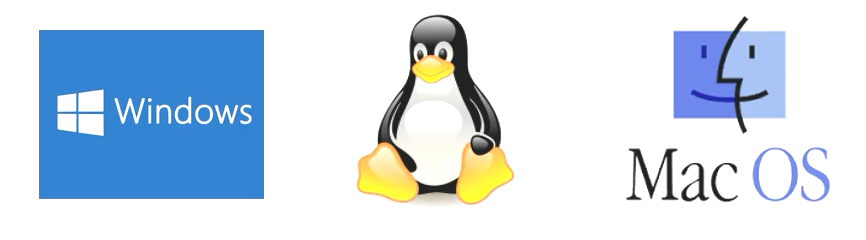
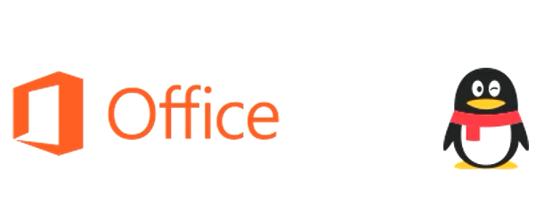
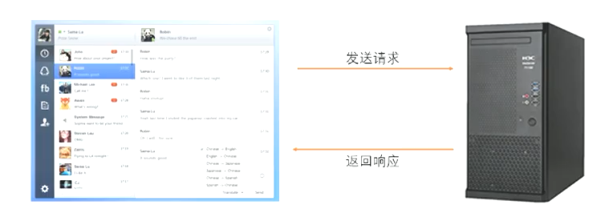

<!-- TOC Marked -->

+ [前端简介](#前端简介)
+ [软件的分类](#软件的分类)
    * [1.1 系统软件](#1.1-系统软件)
    * [1.2 应用软件](#1.2-应用软件)
    * [1.3 游戏软件](#1.3-游戏软件)
+ [客户端与服务器](#客户端与服务器)
    * [2.1. 服务器](#2.1.-服务器)
    * [客户端](#客户端)
+ [网页的特点](#网页的特点)
+ [网页简史](#网页简史)

<!-- /TOC -->

# 前端简介

# 软件的分类

## 1.1 系统软件

*   Windows
*   Linux
*   macOS
    

## 1.2 应用软件

*   Office
*   QQ
    

## 1.3 游戏软件

*   绝地求生
*   王者荣耀
    

# 客户端与服务器

通常情况下，现在的软件一般由两个部分组成：

*   客户端：用户通过客户端来使用软件。
*   服务器：服务器负责在远程处理业务逻辑。
    

## 2.1. 服务器

*   Java
*   PHP
*   C#
*   Python
*   Node.js
*   .......

## 客户端

客户端的形式

*   文字客户端：占老的方式，通过命令行来使用软件
*   图形化界面：通过点击拖动等来使用软件。Windows 中、macOS 中、Android、iOS 中的大部分应用。（C/S 架构）
*   网页：通过访问网页来使用软件。所有的网站都属于这个范畴。（B/S 架构）

# 网页的特点

相较于传统的图形化界面，网页具有如下一些优点：

*   不需要安装
*   无需更新
*   跨平台

网页中使用的语言：

*   HTML、CSS、JavaScript
    

# 网页简史

蒂姆·伯纳斯·李爵士，万维网的发明人。

1991 年 8 月 6 日，世界上第一个服务器和第一个网站在欧洲核子研究中心上线。
第一个网站：
http://info.cern.ch/hypertext/WWW/TheProject.html

