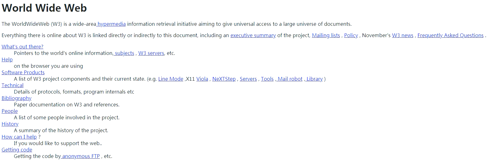

<!-- TOC Marked -->

+ [前端简介](#前端简介)
+ [1-1 软件的分类](#1-1-软件的分类)
    * [1.1 系统软件](#1.1-系统软件)
    * [1.2 应用软件](#1.2-应用软件)
    * [1.3 游戏软件](#1.3-游戏软件)
+ [1-2 客户端与服务器](#1-2-客户端与服务器)
    * [2.1. 服务器](#2.1.-服务器)
    * [2.2 客户端](#2.2-客户端)
+ [1-3 网页的特点](#1-3-网页的特点)
+ [1-4 网页简史](#1-4-网页简史)
+ [1-5 浏览器和网页](#1-5-浏览器和网页)

<!-- /TOC -->

# 前端简介

# 1-1 软件的分类

## 1.1 系统软件

*   Windows
*   Linux
*   macOS


## 1.2 应用软件

*   Office
*   QQ


## 1.3 游戏软件

*   绝地求生
*   王者荣耀


# 1-2 客户端与服务器

通常情况下，现在的软件一般由两个部分组成：

*   客户端：用户通过客户端来使用软件。
*   服务器：服务器负责在远程处理业务逻辑。


## 2.1. 服务器

*   Java
*   PHP
*   C#
*   Python
*   Node.js
*   .......

## 2.2 客户端

客户端的形式

*   文字客户端：占老的方式，通过命令行来使用软件
*   图形化界面：通过点击拖动等来使用软件。Windows 中、macOS 中、Android、iOS 中的大部分应用。（C/S 架构）
*   网页：通过访问网页来使用软件。所有的网站都属于这个范畴。（B/S 架构）

# 1-3 网页的特点

相较于传统的图形化界面，网页具有如下一些优点：

*   不需要安装
*   无需更新
*   跨平台

网页中使用的语言：

*   HTML、CSS、JavaScript


# 1-4 网页简史

蒂姆·伯纳斯·李爵士，万维网的发明人。


1991 年 8 月 6 日，世界上第一个服务器和第一个网站在欧洲核子研究中心上线。

第一个网站：
http://info.cern.ch/hypertext/WWW/TheProject.html



# 1-5 浏览器和网页

有了浏览器我们只需要一个网址便可以访问任何的网站。

而浏览器中所显示的内容正是我们所说的网页。

网页原本的样子：

```html

...
<!--无障碍占位-->
<div id="J_accessibility"></div>
<!--顶通占位 -->
<div id="J_promotional-top"></div>
<div id="shortcut">
  <div class="w">
    <ul class="fl" clstag="h|keycount|head|topbar_01">
      <li class="dropdown" id="ttbar-mycity"></li>
    </ul>

    <ul class="fr">
      <li
        class="fore1 dropdown"
        id="ttbar-login"
        clstag="h|keycount|head|topbar_02"
      >
        <a
          href="//passport.jd.com/uc/login?ReturnUrl=https%3A%2F%2Fwww.jd.com%2F"
          class="link-login"
          >你好，请登录</a
        >&nbsp;&nbsp;<a
          href="//reg.jd.com/reg/person?ReturnUrl=https%3A//www.jd.com/"
          class="link-regist style-red"
          >免费注册</a
        >
      </li>
      <li class="spacer"></li>
      <li class="fore2" clstag="h|keycount|head|topbar_03">
        <div class="dt">
          <a target="_blank" href="//order.jd.com/center/list.action"
            >我的订单</a
          >
        </div>
      </li>
      <li class="spacer"></li>
      <li
        class="fore3 dropdown"
        id="ttbar-myjd"
        clstag="h|keycount|head|topbar_04"
      >
        <div class="dt cw-icon">
          <a target="_blank" href="//home.jd.com/">我的京东</a
          ><i class="iconfont">&#xe610;</i><i class="ci-right"><s>◇</s></i>
        </div>
        <div class="dd dropdown-layer"></div>
      </li>
      <li class="spacer"></li>
      <li class="fore4" clstag="h|keycount|head|topbar_05">
        <div class="dt">
          <a target="_blank" href="//vip.jd.com/">京东会员</a>
        </div>
      </li>
      <li class="spacer"></li>
      <li class="fore5" clstag="h|keycount|head|topbar_06">
        <div class="dt"><a target="_blank" href="//b.jd.com/">企业采购</a></div>
      </li>
      <li class="spacer"></li>
      <li
        class="fore8 dropdown"
        id="ttbar-serv"
        clstag="h|keycount|head|topbar_07"
      >
        <div class="dt cw-icon">
          客户服务<i class="iconfont">&#xe610;</i
          ><i class="ci-right"><s>◇</s></i>
        </div>
        <div class="dd dropdown-layer"></div>
      </li>
      <li class="spacer"></li>
      <li
        class="fore9 dropdown"
        id="ttbar-navs"
        clstag="h|keycount|head|topbar_08"
      >
        <div class="dt cw-icon">
          网站导航<i class="iconfont">&#xe610;</i
          ><i class="ci-right"><s>◇</s></i>
        </div>
        <div class="dd dropdown-layer"></div>
      </li>
      <li class="spacer"></li>
      <li
        class="fore10 mobile"
        id="J_mobile"
        clstag="h|keycount|head|topbar_09"
      >
        <div class="dt mobile_txt">手机京东</div>
        <div class="mobile_static">
          <div class="mobile_static_qrcode"></div>
        </div>
        <div id="J_mobile_pop" class="mod_loading mobile_pop"></div>
      </li>
    </ul>
  </div>
</div>
...
```

浏览器渲染后的样子：


浏览器渲染后的样子：

浏览器负责将网页渲染成我们想要的样子。
