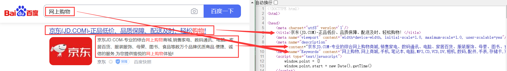

<!-- TOC Marked -->

+ [字符实体与语义标签](#字符实体与语义标签)
+ [1-1 字符实体](#1-1-字符实体)
+ [1-2 meta 标签](#1-2-meta-标签)

<!-- /TOC -->

# 字符实体与语义标签

# 1-1 字符实体

有些时候，在 HTML 中不能直接书写一些特殊符号，如：

*   多个连续的空格（在网页中编写的多个空格默认情况会自动被浏览器解析为一个空格）
*   比如字母两侧的大于小于号（可能会被认为是标签并解析）

如果我们需要在网页中书写这些特殊的符号，则需要使用 html 中的实体（转义字符）实体的语法：`&实体的名字;`，如：

| 实体名称   | 显示结果 | 描述     |
|------------|----------|----------|
| `&nbsp;`   | ` `      | 空格     |
| `&gt;`     | `>`      | 大于号   |
| `&lt;`     | `<`      | 小于号   |
| `&amp;`    | `&`      | 与       |
| `&copy;`   | `©`      | 版权     |
| `&reg;`    | `®`      | 注册商标 |
| `&trade;`  | `™`      | 商标     |
| `&times;`  | `×`      | 乘号     |
| `&divide;` | `÷`      | 除号     |
| `&iquest;` | `¿`      | 倒问号   |

更多的字符实体，可参考：[HTML 字符实体](https://www.w3school.com.cn/html/html_entities.asp) [HTML ISO-8859-1 参考手册](https://www.w3school.com.cn/charsets/ref_html_8859.asp)

# 1-2 meta 标签

以京东网站为例，右键单击，选择 `查看网页源代码`


```html
<meta charset="utf8" version="1" />
<meta
  name="viewport"
  content="width=device-width, initial-scale=1.0, maximum-scale=1.0, user-scalable=yes"
/>
<meta
  name="description"
  content="京东JD.COM-专业的综合网上购物商城,销售家电、数码通讯、电脑、家居百货、服装服饰、母婴、图书、食品等数万个品牌优质商品.便捷、诚信的服务，为您提供愉悦的网上购物体验!"
/>
<meta
  name="Keywords"
  content="网上购物,网上商城,手机,笔记本,电脑,MP3,CD,VCD,DV,相机,数码,配件,手表,存储卡,京东"
/>
```

meta 主要用于设置网页中的一些元数据，元数据并不是给用户看的

*   charset ：指定网页的字符集
*   name ：指定的数据的名称
    *   keywords：表示网站的关键字，可以同时指定多个关键字，关键字间使用,隔开

    *   description：表示网站的描述信息

        

    *   content ：指定的数据的内容，会作为搜索结果的超链接上的文字显示

发现除了 `charset`,`name`,`content`之外，还有一个叫`http-equiv`的属性

> If the http-equiv attribute is set, the <meta /> element is a pragma directive, providing information equivalent to what can be given by a similarly-named HTTP header.

如果设置了`http-equiv` 属性,`<meta>`元素就是一个 pragma 指令，提供的信息相当于一个类似名称的 HTTP 头所能提供的信息。

    *   `content-security-policy`：允许页面作者为当前页面定义一个内容策略。内容策略主要指定允许的服务器来源和脚本端点，这有助于防范跨站脚本攻击。
    *   `content-type`：声明文档的MIME 类型和字符编码。如果指定，content 属性必须有`text/html; charset=utf-8 ` 的值。这相当于一个指定了 charset 属性的`<meta>`元素,并对文档中的位置有同样的限制。**注意**:只能在使用`text/html` 的文档中使用，不能在使用 XML MIME 类型的文档中使用。
